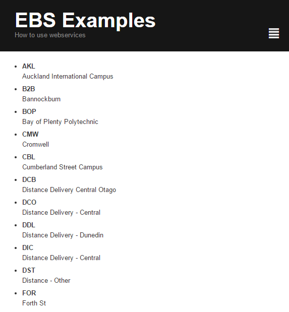

# Reading a service

**LocationsPage.php** Below we have a service that will launch a query against
EBS and return data directly into the template. The web service will take care of
the creating the SilverStripe Objects for you.

If it fails to connect, it will throw an exception.



```php

<?php

class LocationsPage extends Page {
	
}

class LocationsPage_Controller extends Page_Controller {

	public function getLocations() {
		$ebs = EBSWebservice::connect();
		if (!$ebs) {
			throw new SS_HTTPResponse_Exception('Failed to connect to EBS');
		}

		$data_response = $ebs->request("Modules/15427/Screens/HomePage/Data/Locations");

		return $data_response->Data()->Locations;
	}

}
```

**LocationsPage.ss** contains a loop used to go over the data:

```
<ul>
	<% loop Locations %>
	<li>
		<strong>$CODE</strong><br/>
		$DESCRIPTION
	</li>
	<% end_loop %>
</ul>
```
