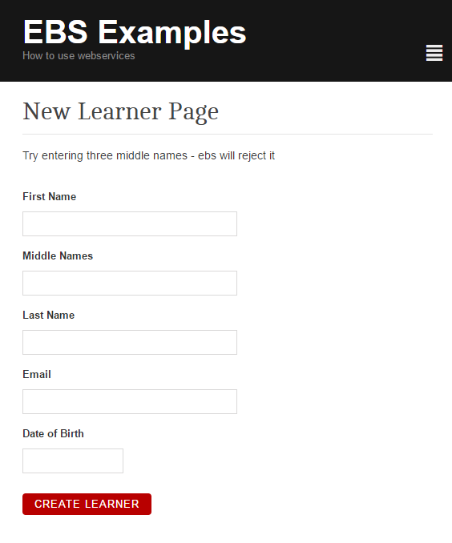

# Creating a new learner

In this example we create a SilverStripe form and insert the data into EBS. The 
result is displayed to the user from the form.

Note the quirks regarding the non standard slashes with EBS. The type is also set
to UserDetails with the return data.



```
<?php

use OP\EBSWebservice;

class LearnerPage extends Page {

}

class LearnerPage_Controller extends Page_Controller {

	private static $allowed_actions = array(
		'Form'
	);

	public function Form() {
		$fields = new FieldList(
				TextField::create('Forename', 'First Name'),
				TextField::create('MiddleNames', 'Middle Names'),
				TextField::create('Surname', 'Last Name'),
				TextField::create('CollegeEmail', 'Email'),
				DateField::create('DateOfBirth', 'Date of Birth')
		);

		$actions = new FieldList(
				FormAction::create("doCreateLearner")->setTitle("Create Learner")
		);

		$form = new Form($this, 'Form', $fields, $actions);

		return $form;
	}

	public function doCreateLearner($data, Form $form) {
		$ebs = EBSWebservice::connect();
		if(!$ebs) {
			throw new SS_HTTPResponse_Exception('Failed to connect to EBS');
		}
		
		// you'll want to limit the fields used for population for production
		$sendarray = $data + array(
			"__Type" => "UserDetails",
			"LearnerUnconfirmedIndicator" => "Y",
			'OwnerType' => 'P',
			"UserFields" => array()
		);
		
		// note we strip the slashes (EBS JSON Parsing issue)
		$data_response = $ebs->request('Users', 'POST', str_replace('\/', '/', json_encode($sendarray)));
		
		if($data_response->Code() !== 200) {
			$form->sessionMessage('EBS failed to create learner', 'bad');
			
			// highlight each field that has an issue with it.
			if($data_response->Errors() !== null && isset($data_response->Errors()->Errors)) {
				foreach($data_response->Errors()->Errors as $error) {
					$form->addErrorMessage($error->_Property, $error->Message, 'bad');
				}
			}
		} else {
			
			$form->sessionMessage('Created new learner! PersonCode : ' . $data_response->Data()->PersonCode, 'good');
		}
		
		return $this->redirectBack();
	}

}

```
