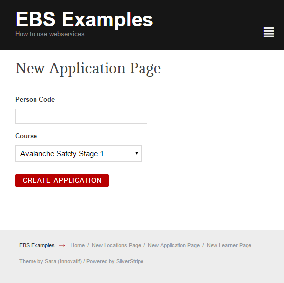

# Creating an application 

You'll need a valid PersonCode and CourseID. See 2_learner.md for the PersonCode.

It's likely your EBS instance has been modified and won't return valid UIOs for the 
application dropdown, but is still worth looking at for an example on how to search for data.



```php

<?php

use OP\EBSWebservice;

class ApplicationPage extends Page {
	
}

class ApplicationPage_Controller extends Page_Controller {

	private static $allowed_actions = array(
		'Form'
	);

	public function Form() {

		$ebs = EBSWebservice::connect();

		// this will use a built in EBS query to get 100 UIOs created in the last year.
		// Note - you may have to build your own query with valid UIOs. We copied it, and created a U_SearchResults_Prog service.
		$data_response = $ebs->request(
				"Modules/15427/Screens/SearchResults_Course/Data/SearchResultsCourse?sp_COURSE_START_DATE_operator=GreaterThan&sp_COURSE_START_DATE=01/01/" . date("Y"));
		
		$fields = new FieldList(
				TextField::create('PersonCode', 'Person Code'), DropdownField::create('CourseId', 'Course', $data_response->Data()->SearchResultsCourse->map('UIO_ID', 'COURSE_DESCRIPTION'))
		);

		$actions = new FieldList(
				FormAction::create("doCreateApplication")->setTitle("Create Application")
		);

		$form = new Form($this, 'Form', $fields, $actions);

		return $form;
	}

	public function doCreateApplication($data, Form $form) {
		$ebs = EBSWebservice::connect();
		if (!$ebs) {
			throw new SS_HTTPResponse_Exception('Failed to connect to EBS');
		}

		// you'll want to limit the fields used for population for production
		$sendarray = $data + array(
			'ProgressCode' => 'WEBAPP',
			"UserFields" => array()
		);
		
		// note we strip the slashes (EBS JSON Parsing issue)
		$data_response = $ebs->request('Applications', 'POST', str_replace('\/', '/', json_encode($sendarray)));

		if ($data_response->Code() !== 200) {
			$form->sessionMessage('EBS failed to create application', 'bad');
			// highlight each field that has an issue with it.
			if ($data_response->Errors() !== null && isset($data_response->Errors()->Errors)) {
				foreach ($data_response->Errors()->Errors as $error) {
					$form->addErrorMessage($error->_Property, $error->Message, 'bad');
				}
			}
		} else {
			$form->sessionMessage('Created new application! ApplicationCode : ' . $data_response->Data()->ApplicationCode, 'good');
		}
		return $this->redirectBack();
	}

}


```
