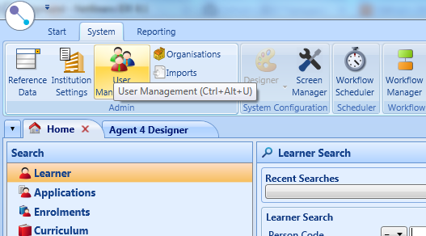
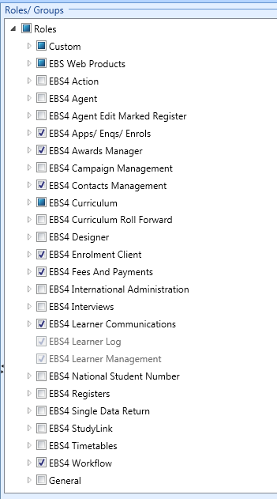
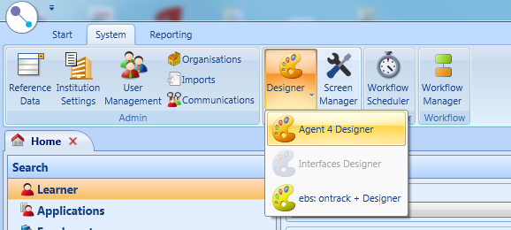

# EBS - SilverStripe interface

This extension allows a SilverStripe instance communicate with Tribals EBS4 
Student Management System via a web service. You can customise your own read only 
web service, giving you full access to the student database. 


# installation

```composer require otago/ebs```

Then create an EBS user:

1. Open 'EBS Central' (client)
2. Access user management 
3. Create a new role 

If you do not have permission to do this, you may need to seek your SMS administrator.

After create a **mysite/_config/ebs.yml** file with your EBS web service user details in it:

```php
---
Name: EBSWebservice
---
EBSWebservice:
    authentication:
        username: webservicename
        password: webservicepassword
        locationTest: https://ebs-test.organisation.domain/Rest/
        locationDev:  https://ebs-dev.organisation.domain/Rest/
        locationLive: https://ebs-live.organisation.domain/Rest/
```

Use a VPN or Firewall rules to secure data can only move between EBS and your web server. 

# How to edit web services

You can do this with agent designer in client allows SMS users to create SQL 
queries that feed into JSON web services. There are plenty of out of the box SQL 
queries which you can use such searching (see example 3). 

1.  

# Examples 

See docs/ folder

 1. Reading a service
 2. Creating a learner
 3. Creating an application - with a dynamic


